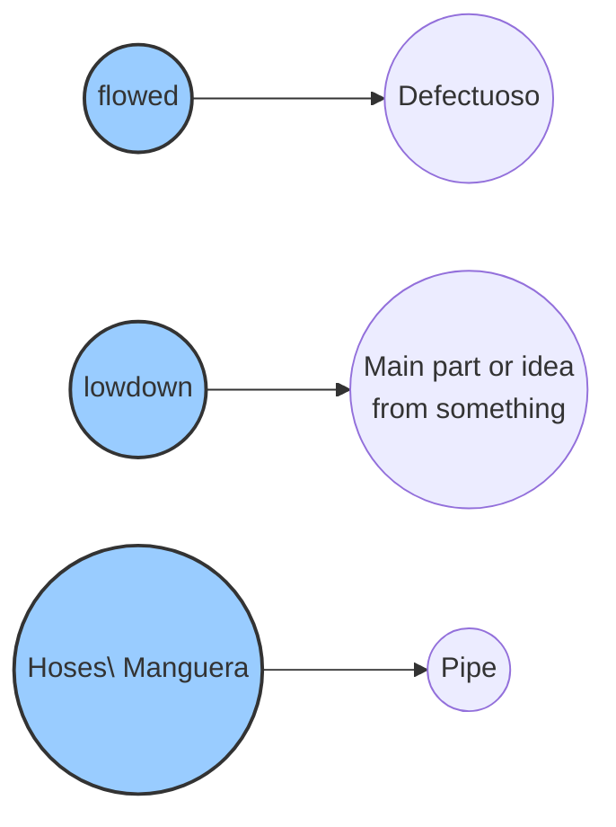

# Proveedor de seguridad (IPd) para servicios VKM

La aplicación de negocios se puede configurar para trabajar con seguridad utilizando esquemas de autenticación o autorización. Para usar estas características, los servicios deben recibir ciertos valores en los encabezados (headers), dependiendo del servicio.

### Encabezados requeridos para servicios VKM

Los posibles valores en el encabezado son:

| Header        | Detalle                                         |
|:--------------|:-------------------------------------------------|
| VKMSM_TOKEN   | Token retornado por la aplicación de seguridad |
| IP            | Dirección IP desde la cual se solicitó el token |

## Información de la aplicación de seguridad

- **Host**: 192.168.3.86
- **Puerto**: 8090
- **Base_URL**: VKMSM

### Solicitud de token
- **Endpoint**: http://[Host]:[Port]/[Base_Url]/rest/API/v1/GetToken
- **Método**: POST
- **Body**:
  ```json
  {
    "Username": "[usuario]",
    "UserPassword": "[Contraseña]",
    "AdditionalParameter": "[IP]"
  }
  ```
  
Donde
	Usuario: Un usuario de la aplicacion de seguridad
	Contraseña: Contraseña del usuario, la misma puede viajar encriptada o plana dependiendo configuracion de la empresa en la aplicacion de seguridad
	IP: Direccion IP para la cual se quiere solicitar token. El valor no puede ser nulo, por lo que el valor vacio es: 0:0:0:0:0:0:0:1

### Ejemplo de solicitud de token que utiliza contraseña encriptada e IP vacia
Body: 
```json
{
	 "Username":"admin",
	 "UserPassword":"Njn2aQS2/dIwJeIyEoT+wQ==",
	 "AdditionalParameter":"[IP]"
 }
```
---
## Validacion de token ( solo para autenticacion)

- **Endpoint**:  http://[Host]:[Port]/[Base_Url]/rest/API/v1/CheckToken
- **Metodod**: POST
- **Body**:
  ```json
   {"SessionToken":"[Token]",
   "AdditionalParameter":"[IP]"
   }

### Ejemplo de validacion de token (caso de autenticacion) 
Body: 
```json
{
	"SessionToken":"d9bcb9ad-5452-446a-9752-0ce56973d2dd",
	"AdditionalParameter":"0:0:0:0:0:0:0:1"
}
```
---
## Validacion de token ( solo para autorización)

- **Endpoint**:  http://[Host]:[Port]/[Base_Url]/rest/API/v1/CheckAuthorization
- **Metodod**: POST
- **Body**:
  ```json
	{"SessionToken":"[Token]",
	"RepositoryKey":"[Id Repositorio /opcional]",
	"ApplicationKey":"[API_KEY]",
	"FunctionalityKey":"[Funcionalidad]",
	"AdditionalParameter":"[IP]",
	"Action":"[opcional]"}

### Ejemplo de validacion de token (caso de autorización) 
Body: 
```json
{
		"SessionToken":"d9bcb9ad-5452-446a-9752-0ce56973d2dd",
		"RepositoryKey":"",
		"ApplicationKey":"5fe69de1-0c79-441d-875c-62245eef3ae0\r\n\r\n",
		"FunctionalityKey":"UI.Remote.getMenu",
		"AdditionalParameter":"0:0:0:0:0:0:0:1","Action":""
	}
```
---
## Flujo de obtencion y validación de token

Lo primero que se debe hacer es utilizar el servicio GertToken para obtener un token, una vez obtenido el mismo debe ser enviado en el header del servicio de negocios que se desea utilizar, junto con la dirección IP y la funcionalidad que se desea utilizar. El servicio en la capa de negocio recibe los datos del encabezado (token, IP, funcionalidad) y cunsume el servicio de validacion de token segun corresponda. Si el token es válido, el servicio de negocio continua , caso contrario retorna un mensaje de error.

Ejemplo de 




